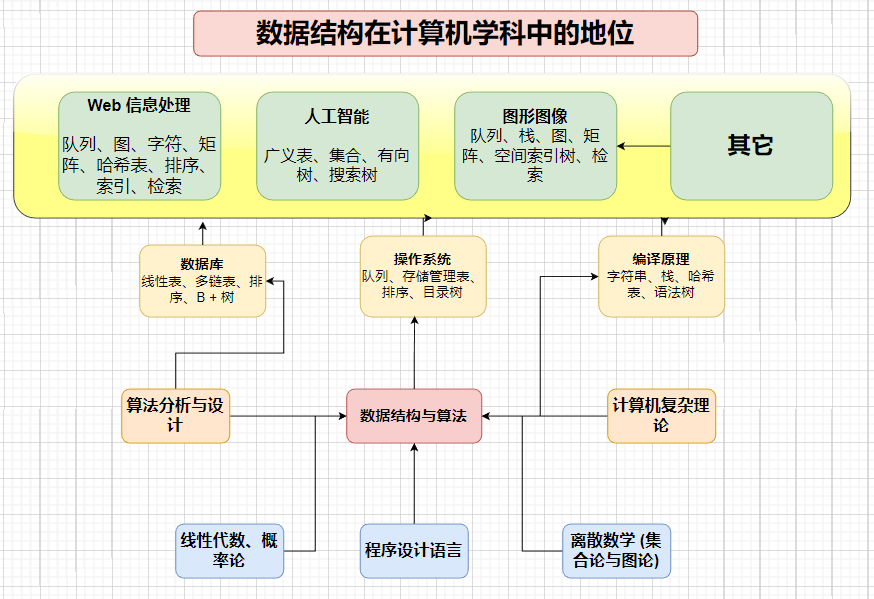
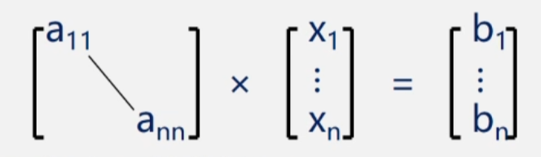
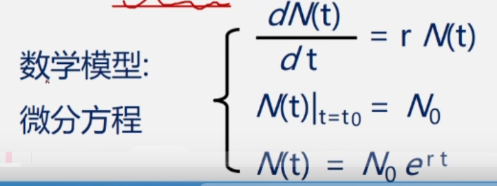
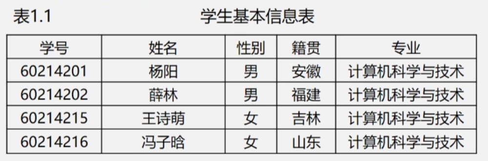
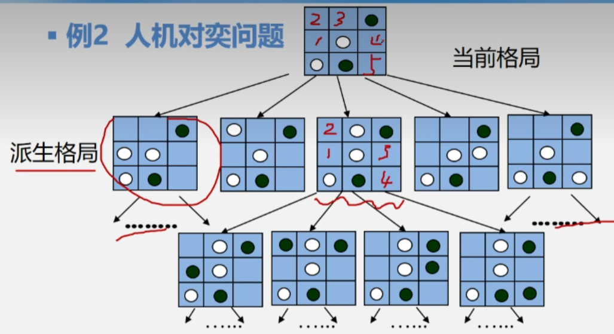
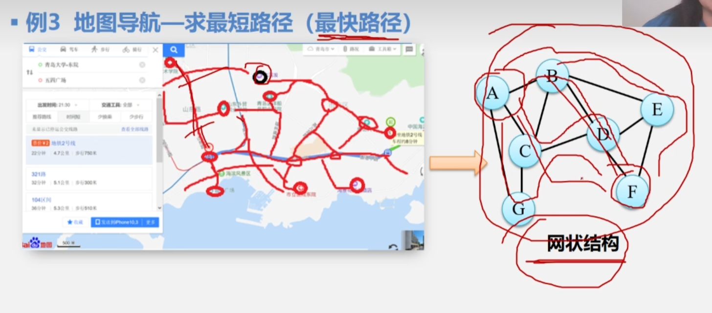
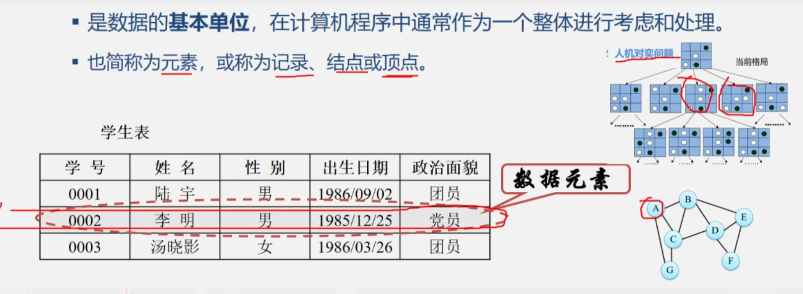
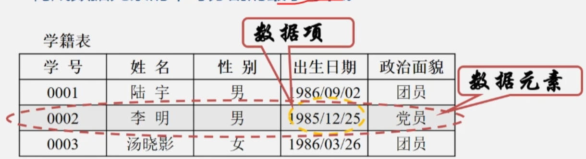
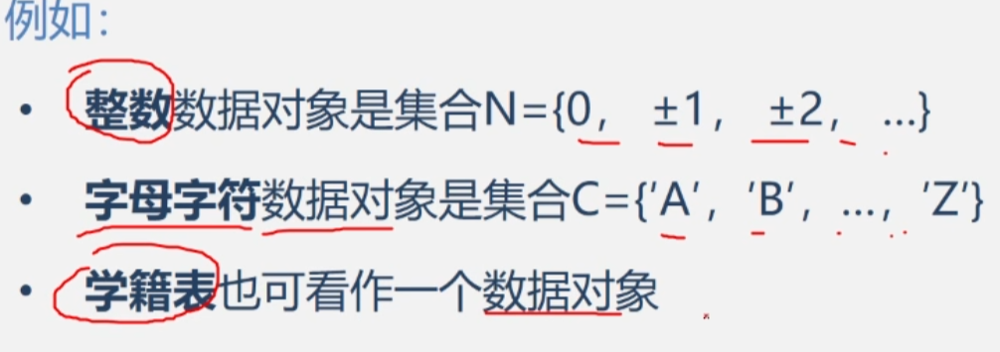

# 基本概念及相关术语

主要学习有关数据结构的概念以及基本术语

# 一、前言

> [!NOTE] 程序的定义 
>
> 凭借一句话获得图灵奖的 Pascal 语言之父 —— Nicklaus Wirth ，让他获得图灵奖的这句话就是他提出的著名公式：程序 = 数据结构 + 算法 这个公式对计算机科学的影响程度足以类似物理学中爱因斯坦的 E = MC^2

## 1.1 数据结构在计算机学科中的地位

大学课程安排：[线性代数(概率论) + 程序设计语言 + 离散数学(集合论与图论)] --> 数据结构

## 1.2 如何学好数据结构

学好数据结构需要我们：

- **勤于思考**
- **多做练习**
- **多上机操作**
- **善于寻求帮助**
- **不怕困难、不放弃**

# 二、数据结构的研究

## 2.1 如何使用计算机解决问题

1. 具体问题抽象为数学模型
   1. **分析问题**
   2. **提取操作对象以及对象间的关系**
   3. **使用数学语言进行描述 --> 数据结构**
2. 设计算法
3. 编辑、编译、链接、运行
4. 调试

##  2.2 使用计算机进行 数值计算

- 首先，分析问题、提取操作对象
- 然后，找出操作对象之间的关系，用数学语言加以描述，建立相应的数学方程
- 最后，求解数学方程：高斯消元法、有限元法、差分法等 —— 计算数学研究范畴

> [!NOTE] 该类案例的特点 
>
> 数据元素间的关系简单，但计算复杂，如：
>
> - 学生学籍管理系统 数学模型：K U = M 线性方程组
>
> 
>
> - 预报人口增长情况
>
> 

## 2.3 使用计算机进行 非数值计算

这类问题的共性都是无法用数学的公式或方程来描述，是一些 非数值计算 的程序设计问题描述非数值计算问题的数学模型不是数学方程，而是诸如表、树和图 之类的具有逻辑关系的数据

### 学生学籍管理系统 (1:1)

- **操作对象：**每位学生的信息 （学号、姓名、性别、籍贯、专业） 
- **操作算法：**查询、插入、修改、删除等 操作对象之间的关系：线性关系。 
- **对应的数据结构：**线性数据结构中的 线性表

### 对弈问题 （1:n）

之所以能对弈：策略已经输入计算机，可以根据当前期棋盘格局，来预测棋局发展的局势，甚至最后结局

- **操作对象：**各种棋局状态，即描述棋盘的格局信息 
- **操作算法：**走棋，即选择一种策略使棋局状态发生变化 (由一个格局派生出另一个格局) 
- **操作对象之间的关系：**一对多 (树状) 非线性关系。 
- **对应的数据结构：**非线性结构中的 树

### 地图导航-求最短 (最快) 路径 (m:n)

- **操作对象：**各种路径  
- **操作算法：**根据条件选取最短 (最快) 的路径 
- **操作对象之间的关系：**多对多 (图状) 非线性关系。 
- **对应的数据结构：**非线性结构中的 图

## 2.4 数据结构的定义 (研究范畴)

数据结构 是一门研究 非数值计算 的程序设计中计算机的 操作对象 以及它们之间的 关系 和 操作 的学科

# 三、基本概念和术语

## 3.1 基本概念

1. **数据** 是能输入计算机且能被计算机处理的 **各种符号的集合**，是 **信息的载体** 是 **对客观事物符号化的表示** 能够被计算机识别、存储和加工，包括： 数值型的数据：整数、实数 等 非数值型的数据：文字、图像、图形、声音 等

2. **数据元素** 是数据的 **基本单位** 在计算机程序中通常作为一个整体进行考虑和处理。又称为 **元素或记录 (1:1)、结点 (1:n) 和 顶点 (m:n)**。

   

3. **数据项** 是构成数据元素的不可分割的 **最小单位**

## 3.2 数据、数据元素、数据项 的关系

数据 > 数据元素 > 数据项 

e.g: 学生表 > 个人记录 > 学号、姓名......

## 3.3 数据对象

数据对象 是 性质相同的数据元素的集合 是 数据的一个子集

> [!NOTE] 数据元素与数据对象
>
> - 数据元素 —— 组成数据的基本单位  与数据的关系为：集合与个体 
> - 数据对象 —— 性质相同的数据元素的集合  与数据的关系为：集合与子集

## 3.4 数据结构

在 [计算机科学](https://zh.wikipedia.org/wiki/计算机科学) 中，**数据结构**（英语：data structure）是计算机中存储、组织 [数据](https://zh.wikipedia.org/wiki/数据) 的方式[[1\]](https://zh.wikipedia.org/wiki/数据结构#cite_note-1)，包括两个层次：

- 逻辑结构 描述数据元素之间的逻辑关系 与数据的存储无关，独立于计算机 是从具体问题抽象出来的数学模型
- 物理结构 (存储结构) 数据元素及其关系在计算机存储器中的结构 (存储方式) 是数据结构在计算机中的表示

包含的内容： 

1. 数据元素之间的逻辑关系，又称为 逻辑结构 
2. 数据元素及其关系在计算机内存中的表示 (又称为 映象) ，称为数据的 物理结构 或 数据的 存储结构 
3. 数据的 运算和实现，即对数据元素可以施加的操作以及这些操作在相应的存储结构上的实现。

数据结构意味着 [接口](https://zh.wikipedia.org/wiki/介面_(電腦科學)) 或 [封装](https://zh.wikipedia.org/wiki/封装_(计算机科学))：一个数据结构可被视为两个函数之间的接口，或者是由 [数据类型](https://zh.wikipedia.org/wiki/数据类型) 联合组成的存储内容的访问方法封装。

大多数数据结构都由 [数列](https://zh.wikipedia.org/wiki/数列)、[记录](https://zh.wikipedia.org/wiki/记录)、[可辨识联合](https://zh.wikipedia.org/wiki/标签联合)、[引用](https://zh.wikipedia.org/wiki/參照) 等基本类型构成。举例而言，可为空的引用（nullable reference）是引用与可辨识联合的结合体，而最简单的链式结构 [链表](https://zh.wikipedia.org/wiki/链表) 则是由记录与可空引用构成。

数据结构可透过 [编程语言](https://zh.wikipedia.org/wiki/编程语言) 所提供的 [数据类型](https://zh.wikipedia.org/wiki/数据类型)、[引用](https://zh.wikipedia.org/wiki/參照) 及其他操作加以实现。一个设计良好的数据结构，应该在尽可能使用较少的时间与空间资源的前提下，支持各种程序执行。[[2\]](https://zh.wikipedia.org/wiki/数据结构#cite_note-2)

不同种类的数据结构适合不同种类的应用，部分数据结构甚至是为了解决特定问题而设计出来的。例如 [B树](https://zh.wikipedia.org/wiki/B树) 即为加快树状结构访问速度而设计的数据结构，常被应用在数据库和文件系统上。

正确的数据结构选择可以提高 [算法](https://zh.wikipedia.org/wiki/演算法) 的效率（请参考 [算法效率](https://zh.wikipedia.org/wiki/算法效率)）。在[计算机程序](https://zh.wikipedia.org/wiki/计算机程序)设计的过程中，选择适当的数据结构是一项重要工作。许多大型系统的编写经验显示，[程序设计](https://zh.wikipedia.org/wiki/程式設計) 的困难程度与最终成果的质量与表现，取决于是否选择了最适合的数据结构。

[系统架构](https://zh.wikipedia.org/wiki/系統架構) 的关键因素是数据结构而非算法的见解，导致了多种形式化的设计方法与 [编程语言](https://zh.wikipedia.org/wiki/编程语言) 的出现。绝大多数的语言都带有某种程度上的 [模块化](https://zh.wikipedia.org/wiki/模块_(程序设计)) 思想，透过将数据结构的具体实现封装隐藏于用户界面之后的方法，来让不同的应用程序能够安全地重用这些数据结构。[C++](https://zh.wikipedia.org/wiki/C%2B%2B)、[Java](https://zh.wikipedia.org/wiki/Java)、[Python](https://zh.wikipedia.org/wiki/Python) 等 [面向对象](https://zh.wikipedia.org/wiki/面向对象的程序设计) 的编程语言可使用 [类](https://zh.wikipedia.org/wiki/类_(计算机科学)) 来达到这个目的。

因为数据结构概念的普及，现代编程语言及其 [API](https://zh.wikipedia.org/wiki/运行环境) 中都包含了多种默认的数据结构，例如C++[标准模板库](https://zh.wikipedia.org/wiki/标准模板库)中的容器、[Java集合框架](https://zh.wikipedia.org/wiki/Java集合框架) 以及微软的[.NET Framework](https://zh.wikipedia.org/wiki/.NET_Framework)。

> [!NOTE] 数据结构的特点
>
> 数据元素不是孤立存在的，它们之间存在着某种关系，数据元素互相之间的关系成为 结构 是指 相互之间存在一种或多种特定关系 的数据元素集合或者说，数据结构是 带结构的 数据元素的集合

> [!NOTE] 逻辑结构 和 物理结构 的关系
>
> 存储结构是逻辑关系的映象与元素本身的映象 逻辑结构是数据结构的抽象，存储结构是数据结构的实现 两者综合起来建立了 数据元素 之间的 结构关系

## 3.5 逻辑结构的分类

## 3.6 存储结构的种类

### A. 顺序存储结构

### B. 链式存储结构

### C. 索引存储结构

### D. 散列存储结构

## 3.7 数据类型和抽象数据类型

# 四、抽象类型的表示与实现

## 4.1 抽象数据类型 复数 的实现

## 

# 五、总结